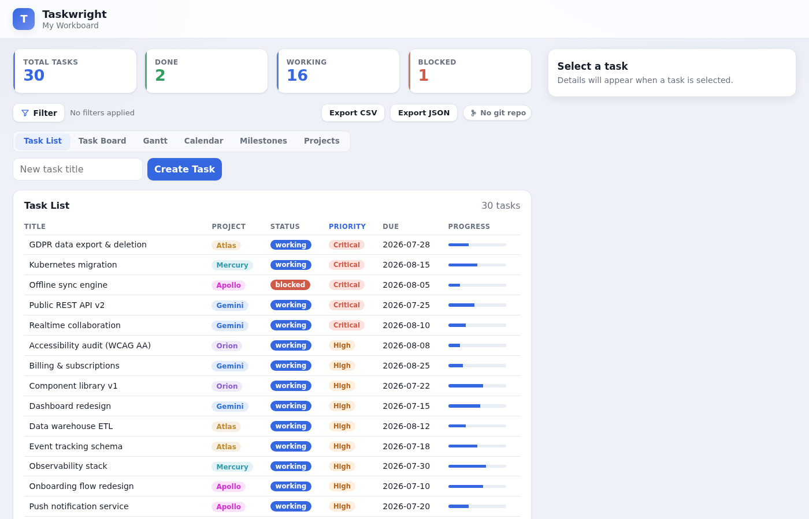
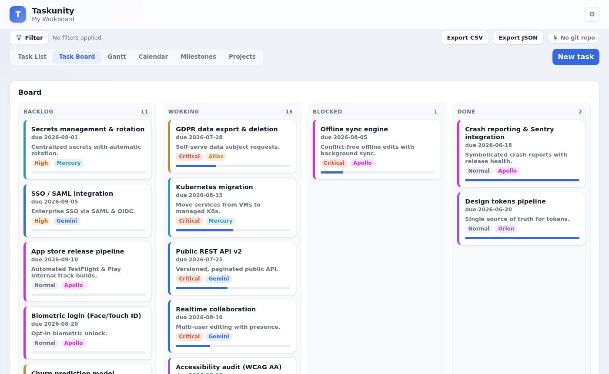
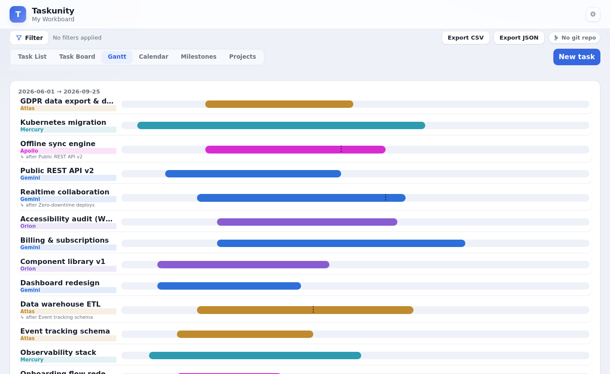
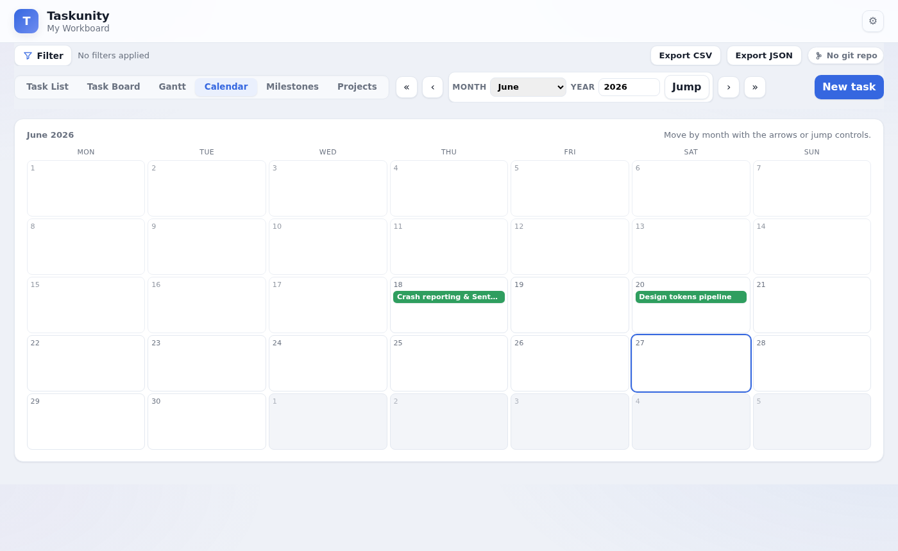
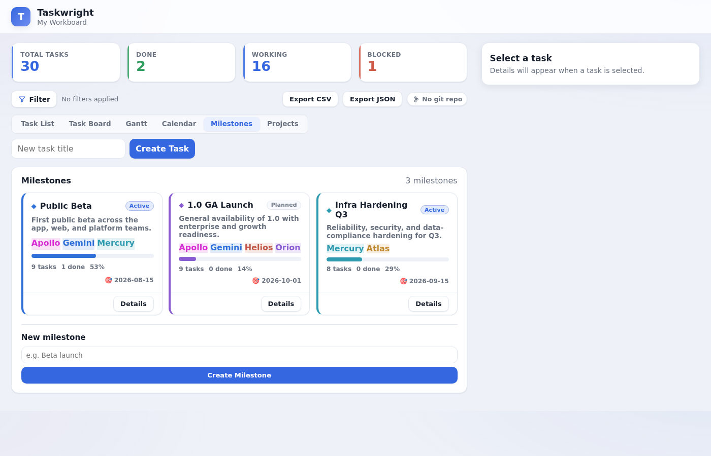
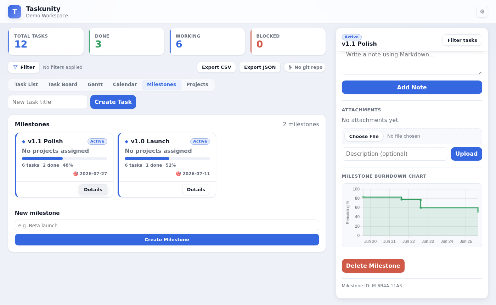
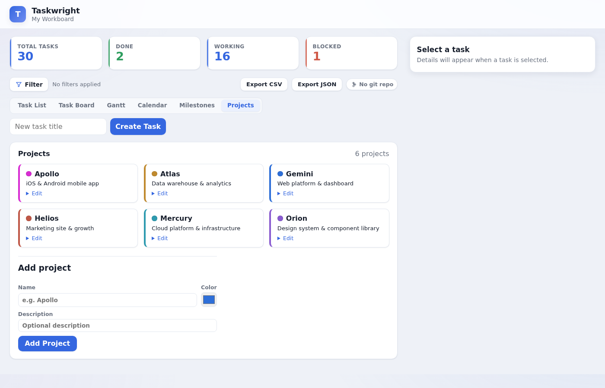
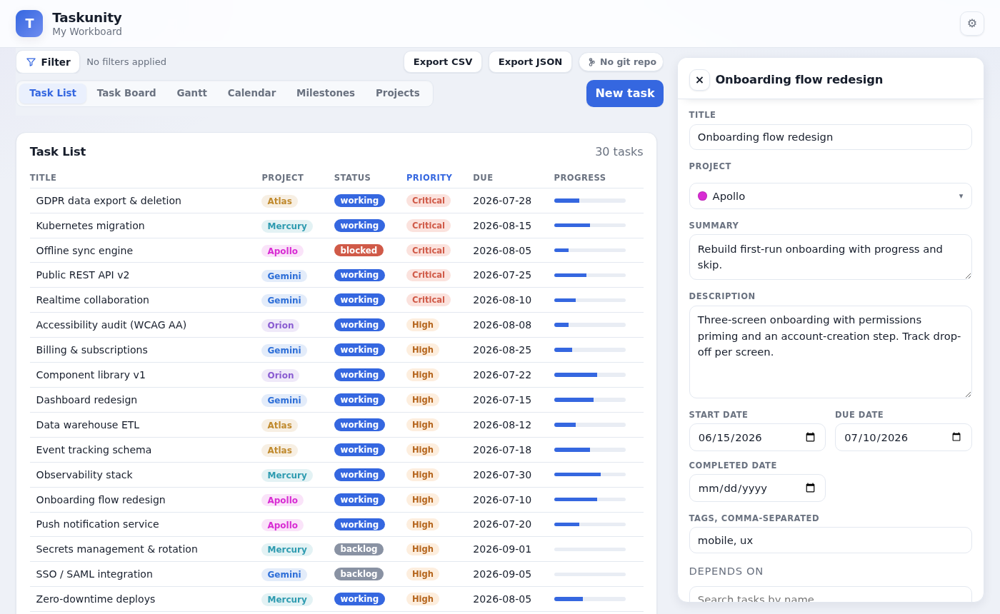
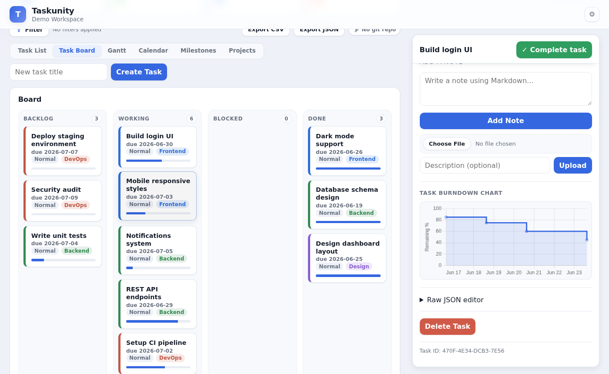
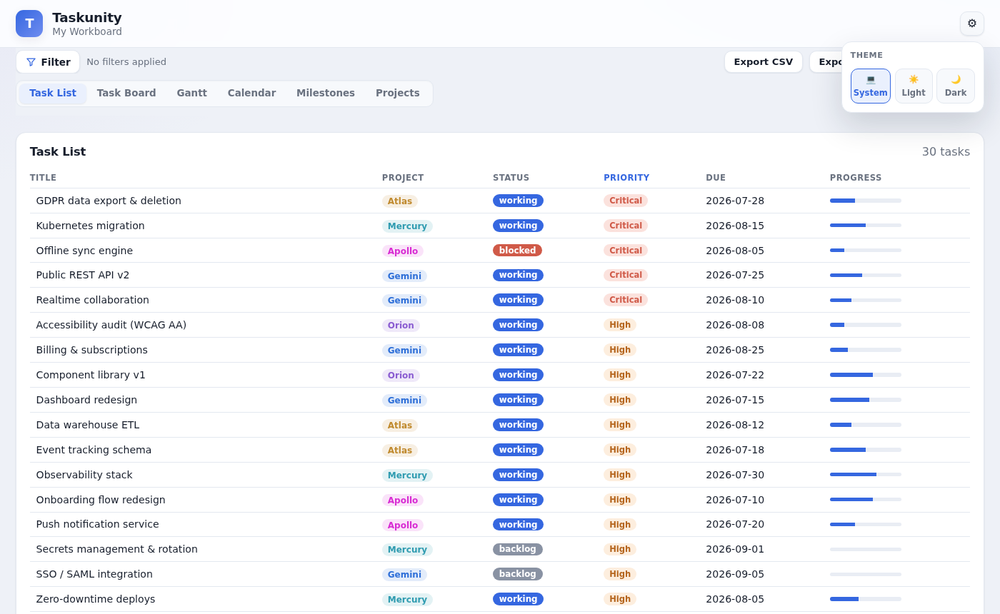

# Using the app

Open `http://127.0.0.1:8000` after starting the server. The interface is a single page with a
toolbar, a main view area, and a task detail side panel.

## Summary cards

Across the top: **Total**, **Done**, **Working**, and **Blocked** counts for the currently filtered
set of tasks.

## Views

Switch views from the toolbar:

- **Task List** — a compact, sortable list of every task.
- **Task Board** — Kanban columns by status, with a colored strip per project.
- **Gantt** — a timeline of tasks by start/due date. Dependencies show an `↳ after <name>` label
  and a marker where the dependency's bar ends.
- **Calendar** — tasks placed on their due dates.
- **Milestones** — milestones that group tasks across projects, each with a rollup. See
  {doc}`milestones`.
- **Projects** — manage projects and their colors.

### Task List

### Task Board

### Gantt Timeline

### Calendar

### Milestones

Click **Details** on any milestone to open the milestone panel, which includes a cumulative
burndown chart aggregating all tasks' progress over time.

### Projects

## The task panel

Click any task (a list row, board card, timeline bar, or calendar entry) to open the side panel.
From there you can:

- Edit core fields (title, status, priority, project, dates, percent complete, tags, summary,
  description).
- Add **dependencies** with the searchable "Depends on" picker — type a task name, see its status /
  project / due date / id, and click to add it. The picker stores the underlying task id.
- Manage the **checklist**.
- Add **notes** or upload **images** via the unified **Activity Log** composer — each submission is
  stamped with a timestamp and shown in the chronological feed.
- View the **Burndown Chart** — a timeline of remaining work derived from every progress change.
- Use the **raw JSON editor** as an escape hatch for anything the form doesn't cover.

Press **Save Task** to write changes back to the task's JSON file. **Complete** / **Reopen** toggles
the done state.

### Task Burndown Chart

The panel scrolls down to reveal a stepped burndown chart — each `progress_update` event is plotted
as a step, and hovering shows the event label ("0% → 40%").

## Filtering, search, and sorting

The toolbar's filter controls let you narrow tasks by:

- **Project** (checkboxes)
- **Date range** (from / to)
- **Free-text search** across id, title, project, summary, description, and tags

Use the **Sort** dropdown to order by priority, due date, title, status, progress, or project.
Active filters render as removable pills.

## Export

Export the current set with **Export CSV** or **Export JSON** from the toolbar.

## Git status & sync

When the workspace is a git repository, a chip in the toolbar shows the branch and ahead/behind/
dirty status. The **Sync** button commits, pulls, and pushes in one step. See {doc}`git`.

## Theme

Click the ⚙ settings button in the top-right corner to choose between **Light**, **Dark**, or
**System** (follows your OS preference). The preference is saved in the browser.

## Creating tasks

Use the **Create Task** box in the toolbar. New tasks created in the UI get a random
`XXXX-XXXX-XXXX-XXXX` id and a matching JSON file in `tasks/`.
</content>
